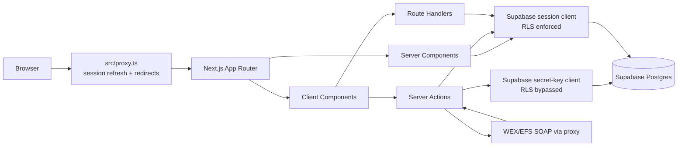
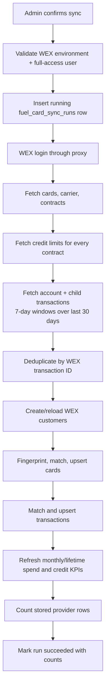
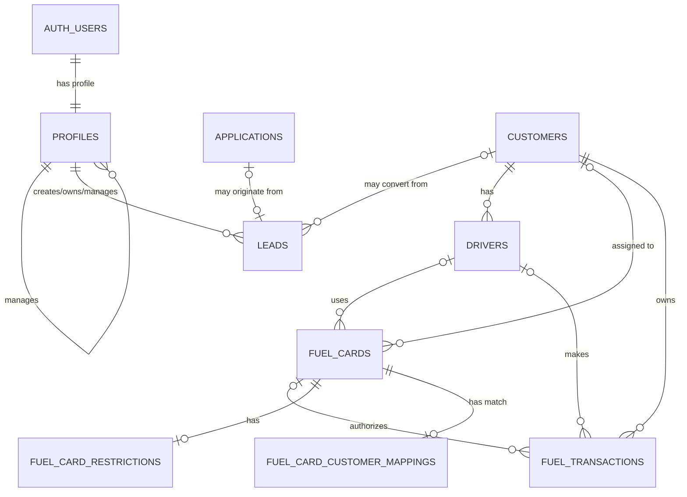

# BESH Fuel CRM — Complete Project Context

> Last code review: 2026-08-05. This document describes the repository's current working tree, including uncommitted changes. It is intended to be the first file read by a human reviewer or an AI model. When this document and executable code disagree, the executable code and latest Supabase migrations are authoritative.

## 1. Executive summary

BESH Fuel CRM is an internal, role-aware web application for managing fuel-card operations and the sales pipeline. It combines:

- CRM authentication and role-based navigation.
- Lead capture, editing, assignment visibility, status tracking, and sales performance views.
- Fuel-account application submission and approval/denial workflows.
- WEX/EFS customer, fuel-card, account-credit, and transaction synchronization through a legacy SOAP service.
- Customer, card, and transaction inventory/detail screens backed by Supabase.
- Role-specific dashboards for executive/operations users, sales managers, and sales agents.
- CSV exports for leads, applications, and WEX transactions.

The application is a Next.js 16 App Router project using React 19, TypeScript, Tailwind CSS 4, shadcn/Base UI components, Supabase Auth/Postgres, Zod validation, Recharts, and Vitest.

The product name displayed in the UI is **BESH CRM** and the package name is `fuel-crm`.

## 2. Current state at a glance

- Git branch at review time: `main`.
- Last committed revision at review time: `dab02ee` (`feat: implement CRM lead management...`).
- The working tree contains many modified and untracked feature files. Preserve them; they are part of the current implementation.
- Tests: **5 files, 32 tests, all passing** on 2026-08-05.
- Lint: **0 errors, 1 warning**. The warning is an unused `activeTabClassName` in `src/components/crm/CustomerSectionTabs.tsx`.
- Production build: code compilation could not be fully verified in the restricted environment because `next/font` tried to download Geist, Inter, and JetBrains Mono from Google Fonts. The observed failure was network/font-fetch related, not a reported TypeScript error.
- There is no root README and no `AGENTS.md` at the time of review. This file fills the project-level context role.

## 3. Business vocabulary

| Term | Meaning in this codebase |
| --- | --- |
| CRM user | An authenticated Supabase user with an active profile in an allowed CRM role. |
| Full CRM access | Owner, admin, or general manager. These roles can access operations data and trigger privileged WEX actions. |
| Sales manager | A manager who can see team leads, applications, sales-agent performance, and manager dashboards. |
| Sales agent | Formerly called `sales_representative`; owns and works personal leads. |
| Driver | A non-CRM role intended to use Besh Mobile; login is rejected in this application. |
| Customer | A CRM fuel account, often synchronized from a WEX carrier identity. |
| WEX carrier | The external account/customer identity returned by WEX/EFS. One CRM customer should exist per carrier ID. |
| Company XRef | A secondary WEX company reference used for customer/card matching. |
| Fuel-card fingerprint | HMAC-SHA256 of a normalized full card number. Used for stable matching without storing the full number. |
| Match | Association between a WEX fuel card and a CRM customer, automatic or manually confirmed. |
| Application | A detailed fuel-account application containing business, banking, and personal guarantor data. |
| Successful lead | The current status corresponding to a lead inserted/converted into CRM. |

## 4. Technology stack

### Runtime and framework

- Node.js `24.x` (declared in `package.json`).
- Next.js `16.2.10`, App Router, Turbopack production build.
- React and React DOM `19.2.7`.
- TypeScript `5.9.3` with strict mode, no emit, bundler module resolution, and `@/* -> ./src/*` aliasing.
- Server Components are the default. Interactive components declare `'use client'`.
- Server Actions implement mutations and reusable server-side queries.

### Data, authentication, and validation

- Supabase Postgres and Supabase Auth.
- `@supabase/ssr` for browser/server clients and cookie-backed sessions.
- A server-only Supabase secret-key client bypasses RLS for trusted WEX synchronization.
- Zod validates login, lead forms, WEX configuration, normalized SOAP payloads, filters, and action inputs.

### UI

- Tailwind CSS 4 through `@tailwindcss/postcss`.
- shadcn configuration uses `base-nova`, Base UI primitives, CSS variables, Lucide icons, and React Server Components.
- Recharts for pies, lines, areas, and sparklines.
- `next-themes` for light/dark/system themes.
- Sonner for toast notifications.
- Framer Motion is installed; the current project mostly uses CSS animation classes.
- TanStack React Query is provided globally, although current pages primarily use Server Components and Server Actions.
- TanStack React Table powers the generic `DataTable` helper.

### WEX integration

- `fast-xml-parser` parses SOAP XML.
- Node `crypto.createHmac` fingerprints card numbers.
- Undici `ProxyAgent` sends all WEX SOAP traffic through the configured HTTP proxy.

### Testing and quality

- Vitest for unit tests.
- ESLint 9 with Next.js core-web-vitals and TypeScript rules.
- No end-to-end test framework is configured.

## 5. Repository layout

```text
.
├── PROJECT_CONTEXT.md                 # This handbook
├── docs/
│   └── wex-integration.md             # Concise WEX field/operation mapping
├── public/images/login-fleet.png      # Login-page fleet artwork
├── src/
│   ├── app/
│   │   ├── (auth)/login/              # Public login screen
│   │   ├── access-denied/             # Non-CRM-role destination
│   │   ├── actions/                    # Auth, application, lead, and WEX Server Actions
│   │   ├── api/                        # Transaction CSV and WEX sync-status endpoints
│   │   ├── crm/                        # Protected CRM route tree
│   │   ├── globals.css                 # Theme tokens and global styling
│   │   └── layout.tsx                  # Fonts, theme, query provider, global shell
│   ├── components/
│   │   ├── crm/                        # Domain UI, tables, filters, charts, drawers
│   │   └── ui/                         # shadcn/Base UI primitives
│   ├── lib/
│   │   ├── integrations/wex/           # SOAP client, parsers, schemas, sync, KPI helpers
│   │   ├── supabase/                   # Browser, server-session, and admin clients
│   │   ├── validation/                 # Login and lead Zod schemas/tests
│   │   ├── mock-data.ts                # Legacy/demo records used only by drawer components
│   │   └── utils.ts                    # Tailwind-aware `cn()` helper
│   ├── proxy.ts                        # Session refresh and route redirects
│   ├── supabase/migrations/            # Older standalone schema script; not primary history
│   └── types/database.types.ts         # Hand-maintained partial database/domain types
├── supabase/migrations/                # Authoritative chronological database migrations
├── components.json                     # shadcn project configuration
├── package.json / package-lock.json
├── next.config.ts
├── tsconfig.json
├── eslint.config.mjs
└── postcss.config.mjs
```

Ignored local/generated directories may still exist:

- `.next/`: Next.js build/dev output.
- `node_modules/`: installed dependencies.
- `xml_files/`: ignored WEX WSDL and sanitized/request samples used during integration development. Do not treat these as deployable source.
- `supabase/.temp/` and `supabase/.branches/`: local Supabase CLI state.
- `.env.local`: local secrets; never commit or quote its values.
- `tsconfig.tsbuildinfo`, `next-env.d.ts`, `.DS_Store`: generated/local files.

## 6. Runtime architecture and request flow



1. `src/proxy.ts` creates a Supabase SSR client on matching requests, refreshes auth cookies through `getUser()`, and redirects based on authentication.
2. `/crm/*` then enters `src/app/crm/layout.tsx`, which loads the active profile and rejects profiles outside `CRM_ROLES`.
3. Server pages query Supabase directly through the cookie-aware server client. Database RLS remains the final row-level gate.
4. Client components invoke Server Actions for login/logout, application updates, lead mutations, WEX sync, and manual card assignment.
5. WEX sync first verifies an authorized full-access user, then uses the secret-key Supabase client for controlled provider writes.
6. Interactive filters encode state in the URL, causing Server Components to rerender with validated search parameters.

## 7. Authentication, profiles, and authorization

### Authentication lifecycle

- `/` redirects to `/crm/dashboard` if authenticated, otherwise `/login`.
- Unauthenticated access to `/crm/*` redirects to `/login`.
- Authenticated access to `/login` or `/signup` redirects to `/crm/dashboard`. There is currently no signup page.
- Login uses Supabase email/password authentication.
- Email is trimmed and lowercased. Passwords must be non-empty, at most 1,024 characters, and contain no NUL byte.
- After successful authentication, `login()` requires exactly one active profile whose `auth_user_id` matches the auth user.
- Allowed login roles are owner, admin, general manager, sales manager, and sales agent.
- A driver or other non-CRM user is immediately signed out and receives an access-denied error.
- Logout signs out, revalidates the root layout, and redirects to `/login`.

### Roles

The current TypeScript `UserRole` union is:

`owner`, `admin`, `driver`, `general_manager`, `sales_manager`, `sales_agent`, `accounting`, `compliance`, `support`, `marketing`.

`CRM_ROLES` includes only owner, admin, general manager, sales manager, and sales agent.

| Capability | Owner/Admin/GM | Sales manager | Sales agent | Other roles |
| --- | ---: | ---: | ---: | ---: |
| Enter CRM shell | Yes | Yes | Yes | No |
| Operations dashboard | Yes | No | No | No |
| Sales-manager dashboard | No | Yes | No | No |
| Personal sales dashboard | No | No | Yes | No |
| View leads | All allowed by RLS | Manager/team scope by RLS | Own scope by RLS | No |
| Add leads | UI/action currently says no for full-access roles | Yes, initially unassigned | Yes, self-assigned | No |
| Edit visible leads | Yes | Yes, subject to RLS | Yes, subject to RLS | No |
| List active sales agents | Yes | Yes | No | No |
| View/review applications | Yes | Yes | No | No |
| View operations sidebar pages | Yes | No | No | No |
| Trigger WEX sync/manual card match | Yes | No | No | No |
| Sales-agent performance page | No | Yes | No | No |

Important authorization layers:

- Navigation visibility is convenience only; it is not a security boundary.
- Server functions use `requireRoles()` or `requireAdmin()` where implemented.
- Supabase RLS policies and helper functions enforce database scope.
- `requireAdmin()` is historically named: it accepts owner, admin, and general manager.
- The admin client is server-only and uses `NEXT_SUPABASE_SECRET_KEY`; never import it into a client component.

### Reporting hierarchy

- `profiles.manager_profile_id` self-references `profiles.id`.
- Sales-agent rows can point to their manager.
- Leads store creator, assigned agent, and sales-manager profile IDs separately.
- Full-access roles can see all leads.
- A sales manager sees leads associated with that manager/team under RLS.
- A sales agent sees and changes owned/self-assigned leads under RLS.
- Migration `20260721190000` explicitly allows a manager to create an unassigned lead.

## 8. Route catalog

### Public and control routes

| Route | Purpose | Notes |
| --- | --- | --- |
| `/` | Redirect-only entrypoint | Destination depends on auth state. |
| `/login` | Email/password login | Split-screen layout with `public/images/login-fleet.png`. |
| `/access-denied` | Access rejection | Used when the session exists but profile/role is not CRM-authorized. |

### Protected CRM routes

| Route | Purpose | Main behavior |
| --- | --- | --- |
| `/crm/dashboard` | Role-specific dashboard | Owner/admin/GM operations KPIs; manager team pipeline; agent personal leads. |
| `/crm/leads` | Lead workspace | Date/agent/search/status filters, charts, CSV export, detail/edit sheet, new-lead dialog. |
| `/crm/leads/new` | Compatibility entrypoint | Redirects to `/crm/leads?new=1`. |
| `/crm/applications` | Application overview | Client-side filtering, metrics, CSV export, application table. |
| `/crm/applications/[id]` | Application review | Full application sections, masked sensitive display, approve/reject actions. |
| `/crm/customers` | WEX customer inventory | Search, status/activity/sort filters, pagination, account metrics. |
| `/crm/customers/[id]` | Customer account | Header/KPIs plus fuel cards, deduplicated drivers, transactions, overview tabs. |
| `/crm/fuel-cards` | WEX card inventory | Search/filter/sort/page, sync control, sync health, card activity and exceptions. |
| `/crm/fuel-cards/[id]` | Card detail | Customer assignment, provider metadata, restrictions, recent transactions, sync facts. |
| `/crm/transactions` | WEX transaction analytics | Date/filter/search, period comparison, table, charts/rankings, CSV download. |
| `/crm/sales-agents` | Sales team performance | Sales-manager only; period comparison, rankings, ownership, representative table. |
| `/crm/sales-representatives` | Legacy route | Same page implementation as sales agents. |

### API routes

| Method and route | Purpose | Security/limits |
| --- | --- | --- |
| `GET /api/transactions/export` | Returns filtered WEX transactions as CSV. | Uses the session client/RLS; maximum 10,000 rows. Supports `from`, `to`, `status`, `customer`, `card`, `fuelType`, `q`. |
| `GET /api/wex-sync/[runId]` | Polls sync state/progress. | Requires full CRM access and restricts the run to `created_by = current auth user`; sends `Cache-Control: no-store`. |

## 9. Navigation and shell

- CRM layout is a full-height shell with a 202px fixed sidebar on large screens and a sticky 57px header.
- The sidebar is hidden below the `lg` breakpoint; no mobile drawer/menu is currently implemented.
- Full-access sidebar: Dashboard, Leads, Applications, Customers, Fuel Cards, Transactions, Reports, Settings.
- Sales-manager sidebar: Dashboard, Leads, Applications, Sales Agents.
- Sales-agent sidebar: Dashboard, My Leads.
- Reports is disabled and marked “Coming soon.”
- Settings currently links to `#` and has no implemented page.
- Header title derives from pathname.
- Header global search is visibly disabled and marked as coming soon.
- Notification icon has no current action.
- Theme control toggles light/dark after client mount to avoid hydration mismatch.

## 10. Feature details

### 10.1 Dashboards

The dashboard dispatches entirely by current profile role.

#### Owner/admin/general-manager dashboard

- Default period: current calendar month through today; custom inclusive `from`/`to` dates become an exclusive UTC end boundary.
- Counts active cards and active customers independent of the selected period.
- Aggregates posted transactions in the period: gallons, spending, and savings.
- Builds daily gallons/spend series, spending by merchant state, top five locations by gallons, and five recent transactions.
- Loads all visible leads for a recent-leads card.
- Uses 1,000-row pagination internally when aggregating transactions, avoiding a single-query row cap.

#### Sales-manager dashboard

- Uses visible leads and active sales agents, with selected-period filtering performed in application code.
- Metrics: total leads, in-progress/follow-up leads, accepted/progressed leads, conversion rate, active agents, and estimated monthly gallons.
- Shows lead-status distribution, per-agent performance, attention queue, recent leads, and quick actions.
- Attention priority considers old `new` leads and elapsed business days. Weekends are excluded by the helper.
- “Open” means any status except `successful` or `deal_lost`.

#### Sales-agent dashboard

- Loads the signed-in agent's leads.
- Shows total, new, successful, and in-process/follow-up counts plus status chart and personal lead table.
- Provides quick links to add or view leads.

### 10.2 Leads

Current lead statuses:

- `new`
- `on_the_process`
- `follow_up`
- `successful`
- `deal_lost`

Current account types:

- `prepaid_account`
- `deposit`
- `credit_line`

Lead fields include contact identity, optional company/email/phone, fleet size, preferred network, estimated monthly gallons, account type, source, notes, ownership hierarchy, optional application/customer links, status timestamps, and audit timestamps.

Creation rules and validation:

- Only sales managers and sales agents can currently call `createLead()`.
- First and last name are required, trimmed, max 80 characters.
- At least email or phone is required.
- Email max 254 and validated if present.
- Phone max 30 and allows common international punctuation.
- Fleet size is an optional whole number from 0 through 1,000,000.
- Estimated monthly gallons is an optional whole number from 0 through 1,000,000,000.
- Preferred network max 100; source max 80; notes max 2,000; company max 160.
- Source defaults to `manual` when blank.
- A sales-agent-created lead is self-assigned and uses the agent's manager ID.
- A sales-manager-created lead is unassigned and owned by that manager.

Editing:

- Any visible CRM lead can be submitted to `updateLead()`, but RLS determines whether the row can actually update.
- The edit form can change business/contact/fleet/account fields, status, source, and notes; it does not reassign ownership.
- A database trigger stamps the first transition into successful, lost, process, or follow-up status. Existing timestamps are preserved with `coalesce`.

Lead workspace:

- Defaults to the last 30 inclusive UTC dates.
- Supports `from`, `to`, `rep`, and `new=1` URL state.
- Search/status filtering and CSV export occur client-side on the server-fetched period rows.
- Non-agents can select an active sales agent; agents are pinned to their own profile.
- Charts summarize pipeline, source mix, and top agents.

### 10.3 Applications

Application status is `pending`, `approved`, or `denied`.

Application data is unusually sensitive. It includes:

- Company/contact/address and fleet details.
- Legal structure, industry, revenue, taxpayer/business identifiers.
- Account type, projected spend, and payment method.
- Financial institution, checking account number, and ABA routing number.
- Personal residential address, SSN, date of birth, and phone numbers.
- Authorization/terms flags, review metadata, and denial reason.

Behavior:

- Owner, admin, general manager, and sales manager can list/get/review applications.
- Review writes status, reviewer auth-user ID, review time, and optional denial reason.
- Changing away from denied clears the denial reason.
- Detail UI only enables approve/reject while pending.
- The UI masks sensitive values on display, but the database schema stores the supplied values as text; there is no application-layer field encryption visible in this repository.
- The multi-step new application modal confirms matching email, bank account, routing number, and SSN values before calling `createApplication()`.
- `createApplication()` itself only checks for an authenticated user and relies on database RLS for insert permission.
- There is no dedicated comprehensive server-side Zod schema for applications yet; most validation is HTML/client-side.
- Document request is disabled/coming soon.

### 10.4 Customers

Customer records can be manually rooted in Auth or created/synchronized from WEX. Important fields include type, company/contact data, status, balances/spend/credit, notes, WEX carrier/company/driver keys, provider, last sync, close timestamp, and audit timestamps.

List behavior:

- Summary query reads up to 10,000 customers to calculate cards, spend, status counts, and rankings.
- Filters: query, status, activity (`current`, `stale`, `unsynced`), sort, page, page size.
- Customer “current” versus “stale” uses a 30-day last-sync cutoff.
- Sort options: last synchronized, monthly spend, or company name.
- Account Type is rendered in the filter bar but is not currently read or applied by the page.
- Trend strings/sparklines are static design values, not computed historical changes.
- `failedRecords = 2` is static UI data.

Detail behavior:

- Loads customer record plus up to 10,000 posted transactions for summary analytics.
- Shows spend series, KPIs, contact/account/sync details, and related records.
- Tabs use `view=fuel-cards|drivers|transactions|overview`.
- Card, driver, and transaction tabs use independent page/page-size URL keys.
- Drivers are deduplicated from fuel-card driver identity rather than necessarily coming only from the `drivers` table.
- Overview content explicitly says analytics are coming soon.

### 10.5 Fuel cards

WEX cards never store a full card number. They store last four digits and an HMAC fingerprint.

Inventory filters validated by `fuelCardQuerySchema`:

- `q`: card last four, driver, external driver ID, unit, or status.
- `status`.
- `match`: all, matched, unmatched.
- `policy`.
- `customer`: UUID.
- `sync`: all, current, stale. Card staleness cutoff is one day.
- `from` and `to`: transaction-summary date range.
- `sort`: last sync, driver, unit, status.
- `dir`: ascending/descending.
- `page`; `pageSize`: 10, 25, 50, or 100.

The page shows current inventory metrics, transaction-period spend/savings, last successful sync, failed syncs, exceptions (unmatched, missing driver, overrides), status distribution, recent activity, and the filterable table.

Fuel-card detail shows:

- Last four, provider, status, customer and driver associations.
- WEX driver, unit, policy, payroll, override, GPS, VIN, and zone metadata.
- Daily/weekly/monthly/gallon limits.
- Manual matching facts.
- Product/time/state/merchant restrictions when a restriction row exists.
- 25 recent transactions and last successful sync summary.

Manual assignment:

- Full-access users can assign or remove a customer.
- Assignment upserts a confirmed `manual` mapping, records confirming auth user/time, then updates `fuel_cards.customer_id`.
- Removing assignment deletes the mapping and clears customer ID.
- Errors from the final card update are not explicitly handled in the current action.

Card issuance and provider status mutations are visibly disabled because they are not connected to WEX.

### 10.6 Transactions

- Only provider `wex_efs` is displayed.
- Default date range is the current local calendar month through today, transformed to timestamp boundaries.
- Filters: `q`, `status`, customer UUID, card UUID, provider transaction type (`fuelType`), `from`, `to`, page, page size.
- Search first resolves matching customer/card/driver IDs, then combines those with transaction ID/merchant/location matching.
- The main query joins customers, fuel cards, and drivers.
- Summary reads up to 10,000 current-period transactions and up to 10,000 prior-period transactions.
- Metrics include transaction count, total spend, gallons, savings, active cards, and period-over-period trends.
- Side panels show status distribution, top merchants, top customers, and exception/flag counts.
- CSV export applies equivalent filters and safely quotes commas, newlines, and quotes.
- Transaction row action buttons are disabled; there is no transaction detail route.

## 11. WEX/EFS integration in detail

### Configuration

Required by the active WEX schema:

| Variable | Purpose | Exposure |
| --- | --- | --- |
| `WEX_API_USERNAME` | SOAP login username. | Server only. |
| `WEX_API_PASSWORD` | SOAP login password. | Server only. |
| `WEX_SOAP_ENDPOINT_URL` | Legacy `CardManagementWS` endpoint. | Server only. |
| `WEX_HTTP_PROXY` | Required proxy URL used by Undici. | Server only. |
| `WEX_CARD_FINGERPRINT_SECRET` | HMAC secret, minimum 32 characters. | Server only; rotation affects matching. |

`.env.local` also currently contains `WEX_API_BASE_URL` and `WEX_ACCESS_TOKEN`, but active code does not read them.

### SOAP operations

| Operation | Purpose |
| --- | --- |
| `login` | Returns the client/session ID used by subsequent requests. It intentionally uses an unprefixed operation name. |
| `getCarrierInfo` | Primary carrier identity/name. |
| `getContracts` | Account contract IDs and statuses. |
| `getCreditLimits` | Contract credit limits/availability used for account KPIs. |
| `getCardSummariesV2` | Card identity, assignment, status, policy, unit, payroll, and device metadata. |
| `getMCTransExtLocV3` | Transactions for the authenticated carrier/account. |
| `getChildTransactionsNewV3` | Transactions for child carriers. |

SOAP envelopes use SOAP 1.1 and namespace `http://com.tch.cards.service`. XML values are escaped before interpolation.

### Network behavior and errors

- Every request uses `POST`, content type `text/xml; charset=utf-8`, SOAPAction `""`, the configured proxy, and a 15-second abort timeout.
- Requests retry up to three total attempts for network failures and HTTP 502/503/504.
- SOAP faults are parsed even when the HTTP status is 500.
- Fault messages redact URLs and long identifier-like tokens before becoming errors/logs.
- Error kinds are configuration, network, HTTP, authentication, SOAP fault, and validation.
- The login parser rejects missing, denial-like, or structurally invalid session values.
- Parser normalization removes XML namespace prefixes, accepts singleton-or-array result shapes, converts numeric/boolean values, and validates normalized objects with Zod.

### Synchronization lifecycle



Detailed rules:

1. `startWexSync({confirm:true})` validates configuration and authorization, then inserts an audit row with `status='running'` and queued metadata.
2. The browser calls `executeWexSync({runId})`; the run must belong to that user and still be running.
3. `syncWexFuelCards()` authenticates, then records stage metadata throughout the process.
4. It requests the most recent 30 rolling days in seven-day inclusive millisecond windows. Both account and child transactions are fetched for each window.
5. Transactions are deduplicated in a map keyed by WEX transaction ID.
6. Card numbers are normalized by removing non-digits (or trimming as fallback), HMAC-SHA256 fingerprinted, then discarded. Only last four and fingerprint are written.
7. Carrier records are assembled from primary carrier info plus transaction carrier IDs.
8. New customers are created when neither carrier ID nor company XRef already matches.
9. Card-to-customer resolution order is:
   - existing manually confirmed mapping;
   - unambiguous carrier inferred from transactions sharing the card fingerprint;
   - card company XRef;
   - external driver mapping;
   - sole carrier customer fallback;
   - unmatched (`null`).
10. Cards are upserted in batches of 250 on `(provider, card_fingerprint)`.
11. Transactions match a saved card by fingerprint, then customer by card/customer carrier/company XRef. Transactions with no resolvable customer are skipped.
12. Transactions are upserted in batches of 250 on `(provider, provider_transaction_id)`.
13. Posted transaction rows refresh customer month-to-date and lifetime spend in 1,000-row pages.
14. Active contract credit limits refresh the primary customer's credit limit and current balance.
15. Final provider row counts are stored in sync metadata and the run is marked `succeeded`; caught failures mark it `failed`.

### KPI formulas

- Credit limit: sum of `originalLimit` across contracts whose status does not match closed/inactive/terminated/deleted.
- Current balance: `max(0, credit limit - available credit)` across those contracts.
- Monthly spend: sum of posted CRM transaction amounts at or after the first day of the current UTC month.
- Lifetime spend: sum of all posted CRM transaction amounts for the synchronized customer.
- Currency values are rounded to two decimals.

### Level III transaction storage

Besides basic merchant, gallons, amount, savings, and timestamp fields, synchronized transactions retain authorization code, invoice, contract, billing currency, funded/settled/preferred totals, combined fees, tax totals, WEX location/geography, coordinates, entry mode, hand-entry flag, original transaction, and statement ID.

Variable nested structures are JSONB:

- `prompt_values`: driver/provider prompt type/value pairs.
- `line_items`: amounts, product/category/fuel type, quantities, unit prices, discounts, service type, and line taxes.
- `taxes`: transaction-level taxes with description, class/code, amount, and exemption flag.

## 12. Database model

The chronological files in `supabase/migrations/` are the deployment history. `src/supabase/migrations/create_tables.sql` is an older broad standalone script and overlaps the main migrations; do not apply both blindly.

### Primary tables

#### `profiles`

One row per Supabase Auth user. Fields: UUID ID, unique auth user ID, name, email, role, avatar, manager profile, department, active flag, and timestamps. Profiles drive every application role check and reporting hierarchy.

#### `applications`

Fuel-account applications. Holds business/contact/address/fleet/legal/financial/personal data, acceptance flags, status/reviewer/denial metadata, and timestamps. Foreign keys connect applicant and reviewer to `auth.users`.

#### `leads`

Sales prospects. Holds identity/contact/fleet/account/source/notes/status, creator/assignee/manager, optional application/customer linkage, status-specific timestamps, and audit timestamps.

#### `customers`

Fuel accounts. Holds contact and status data, current/monthly/lifetime/credit KPIs, notes, WEX carrier/company/external-driver keys, provider, sync/close timestamps, and audit timestamps.

#### `drivers`

Customer-associated drivers with identity/contact/license/status/timestamps. Deleting a customer cascades to drivers.

#### `fuel_cards`

Customer and optional driver association; last four/token/provider/status/limits/lifecycle timestamps; WEX fingerprint, policy, unit, external driver, company reference, payroll, override, GPS/VIN/zone/source/subfleet metadata, and sync timestamp. Customer may be null for unmatched WEX cards.

#### `fuel_card_customer_mappings`

One mapping per card. Stores customer, optional external driver, automatic/manual method, confidence, confirmed state/user/time, and timestamps.

#### `fuel_card_sync_runs`

WEX synchronization audit/progress. Stores provider/status/times, received-created-updated-unmatched counts, customer/transaction counts, safe error text, JSON metadata, and initiating auth user.

#### `fuel_card_restrictions`

One restriction set per card: fuel-only/DEF/maintenance flags, allowed/blocked states and merchants, time window, and timestamps.

#### `fuel_transactions`

Customer-required transaction ledger with optional driver/card, type/status, merchant, amount/gallons/savings/date, provider IDs, WEX references, sync time, and Level III columns/JSON described above.

#### `notes`, `activity_logs`, `documents`

Generic entity-associated support tables from the older schema. The current live pages do not provide complete CRUD flows for them. Legacy drawer UI can display mock-backed versions.

### Key relationships



### Database functions and triggers

- `set_updated_at()`: generic update timestamp trigger.
- `handle_new_user()`: creates/maintains a profile from auth-user metadata in remote schema history.
- `current_profile_id()`, `current_user_role()`: active session profile helpers.
- `has_any_role()`, `has_full_crm_access()`, `is_admin(user_id)`: authorization helpers.
- `is_direct_report()`: reporting-hierarchy helper; the sales-representative literal was migrated to sales-agent.
- `can_view_lead()`, `can_insert_lead()`, `can_update_lead()`: RLS predicates.
- `set_lead_status_timestamps()`: stamps status transitions.
- `set_customer_closed_at()`: stamps/clears `closed_at` when customer status changes.
- `general_manager_dashboard(range_start, range_end)`: database aggregate function retained in migrations, although current application code computes the richer operations dashboard directly.
- `sales_manager_dashboard(range_start, range_end)`: database aggregate retained and exposed by `getSalesManagerDashboard()`, though current manager page builds richer metrics from visible rows and does not call that action.

### RLS intent

- RLS is enabled on core CRM tables.
- Full-access roles use `has_full_crm_access()`/`is_admin()` policies for operations data.
- Profiles allow self access, full-access users, and sales-manager visibility into sales-agent rows.
- Leads use hierarchy-aware view/insert/update/delete predicates.
- Applicants may insert/view their own applications; administrative roles can view/update all; a later migration adds sales-manager select/update.
- WEX cards and sync runs are read by authorized users but provider writes are intended to occur via the secret-key service client.
- The generated remote-schema migration contains broad grants, but grants do not bypass enabled RLS. Always evaluate grants and policies together.

### Migration sequence and intent

| Migration | Purpose |
| --- | --- |
| `20260714000000_crm_schema_baseline.sql` | Baseline roles, profiles, applications, customers, drivers, cards, transactions, triggers, basic RLS. |
| `20260715000100_wex_fuel_cards.sql` | WEX card fields, fingerprint uniqueness, mappings, sync audit, service-write policy model. |
| `20260715000200_wex_customers_transactions.sql` | WEX customer and transaction keys plus sync counts. |
| `20260719235959_add_driver_to_user_role.sql` | Adds driver enum role. |
| `20260720000000_profiles_user_role_enum.sql` | Converts/aligns profile role to enum and profile policies. |
| `20260720000100_sales_roles_leads_rls.sql` | Sales hierarchy, leads, RLS helpers, dashboard functions/indexes. |
| `20260721000000_sales_managers_use_database_rows.sql` | Moves manager identity/relationships to actual profile rows. |
| `20260721182305_remote_schema.sql` | Captured remote schema reconciliation, grants, policies, and auth trigger. |
| `20260721190000_allow_unassigned_manager_leads.sql` | Permits manager-created unassigned leads. |
| `20260801000000_add_lead_fleet_fields.sql` | Fleet size/network/estimated gallons plus nonnegative checks. |
| `20260802000000_add_lead_account_type.sql` | Lead account type and valid-value constraint. |
| `20260802000100_update_lead_statuses.sql` | Replaces legacy accepted/rejected/inserted statuses and timestamps. |
| `20260803000000_update_general_manager_dashboard_kpis.sql` | Revises operations dashboard database KPIs. |
| `20260803010000_sales_manager_applications_access.sql` | Sales-manager application select/update RLS. |
| `20260804000000_wex_level_iii_transaction_fields.sql` | Level III transaction columns and indexes. Apply before matching sync code. |
| `20260804000100_rename_sales_representative_to_sales_agent.sql` | Safely renames enum value, function bodies/policies, and RPC output. |

## 13. Supabase client patterns

- `src/lib/supabase/client.ts`: browser client using public URL/publishable key.
- `src/lib/supabase/server.ts`: cookie-aware server client. Cookie write failures are ignored in Server Components because middleware/proxy performs refresh.
- `src/lib/supabase/admin.ts`: server-only client using the Supabase secret key, session persistence and refresh disabled.
- `getCurrentProfile()` requires an active profile.
- `requireRoles()` returns `{error, profile}` instead of throwing.
- Query errors are generally logged server-side and converted to empty/null UI states.

`src/types/database.types.ts` is not a complete generated Supabase schema: it strongly describes profiles, applications, and leads, while customers/cards/transactions are often locally typed or queried through `any`. Regenerating complete database types would reduce drift and unsafe query typing.

## 14. Component architecture

### Global providers

- `Providers.tsx`: creates one React Query client per browser session and renders Sonner toaster.
- `ThemeProvider.tsx`: thin `next-themes` wrapper.
- Root layout loads Inter, JetBrains Mono, and Geist and sets metadata.

### Domain components

- `Sidebar`, `Header`: role-aware shell controls.
- `DashboardDateFilter`: date presets/custom range encoded into URL.
- `OwnerDashboardCharts`, `SalesManagerLeadDistribution`, `LeadStatusChart`, `FuelCardStatusChart`, `TransactionStatusChart`, `EntityOverviewCharts`, `SalesRepOwnershipChart`: Recharts visualizations.
- `LeadsWorkspace`, `LeadsTable`, `NewLeadDialog`: complete lead browsing/create/edit UI.
- `ApplicationsTable`, `NewApplicationModal`: application overview and creation.
- `FuelCardControls`: debounced filters plus two-stage sync start/execute/poll UX.
- `CustomerAssignment`: manual fuel-card/customer matching.
- `CustomerSectionTabs`, `TransactionFilters`: URL-driven record filtering.
- `SalesRepresentativesTable`: pure performance builder and presentation.

### CRM utility components

- `DataTable`: generic TanStack table.
- `PaginatedTable`: client-side pagination over child rows.
- `TablePagination`: server/URL pagination links.
- `RowsPerPageSelect`: URL page-size control.
- `MetricCard`, `StatusBadge`, `ActivityTimeline`, `EntityDrawer`: reusable display primitives.
- `table-page-sizes.ts`: accepted page sizes and safe parser.

### Drawers and mock data

`CustomerDrawer` and `FuelCardDrawer` consume types/data helpers from `src/lib/mock-data.ts`. They appear to be legacy/demo components and are not the primary Supabase-backed detail pages. `ApplicationDrawer` similarly provides an alternate drawer representation. Do not extend mock data under the assumption that it powers the current route pages.

### UI primitives

`src/components/ui/` contains locally owned shadcn/Base UI primitives: alert dialog, avatar, badge, button, card, chart, dialog, dropdown menu, field, input, label, native select, pagination, popover, progress, scroll area, separator, sheet, skeleton, table, tabs, textarea, and tooltip. Modify these carefully because changes affect the entire application.

## 15. Styling and design system

- Global theme lives in `src/app/globals.css` using Tailwind 4 and CSS custom properties.
- Semantic tokens include background/foreground/card/popover, primary/secondary/muted/accent/destructive, borders/rings, charts, sidebar colors, and status-specific lead colors.
- Dark theme overrides tokens under `.dark`.
- `cn()` combines `clsx` and `tailwind-merge` to resolve conditional class conflicts.
- Tables and cards are the dominant information architecture.
- Status colors are semantically named (`status-new`, `status-process`, `status-follow-up`, `status-success`, `status-lost`) rather than hard-coded in most CRM views.
- Responsive layouts use grid breakpoints; however, the hidden mobile sidebar leaves navigation incomplete on small screens.

## 16. URL/search-parameter conventions

- Date values use `YYYY-MM-DD`.
- Inclusive user-selected `to` dates are usually converted to an exclusive next-day timestamp.
- Invalid date ranges fall back to route defaults.
- Search strings are trimmed, length-limited where schema-backed, and strip `%(),` before Supabase `.or()` interpolation.
- Pagination is one-based.
- Page sizes are restricted to 10, 25, 50, or 100.
- Filter changes generally reset page to 1.
- Server pages own database filtering; some already-loaded workspaces (applications/leads) filter in the browser.

## 17. Environment variables

Create `.env.local` locally. Never commit it.

| Variable | Required for | Notes |
| --- | --- | --- |
| `NEXT_PUBLIC_SUPABASE_URL` | All Supabase access | Safe to expose to browser. |
| `NEXT_PUBLIC_SUPABASE_PUBLISHABLE_KEY` | Session/browser/RLS access | Safe to expose; security depends on RLS. |
| `NEXT_SUPABASE_SECRET_KEY` | WEX sync and manual assignment | Server-only, privileged, never expose. |
| `WEX_API_USERNAME` | WEX sync | Server-only. |
| `WEX_API_PASSWORD` | WEX sync | Server-only. |
| `WEX_SOAP_ENDPOINT_URL` | WEX sync | Must be a valid URL. |
| `WEX_HTTP_PROXY` | WEX sync | Required valid URL; all SOAP traffic uses it. |
| `WEX_CARD_FINGERPRINT_SECRET` | Card matching/privacy | At least 32 characters; keep stable or plan a fingerprint migration. |
| `WEX_API_BASE_URL` | Currently unused | Likely residue from another API design. |
| `WEX_ACCESS_TOKEN` | Currently unused | Likely residue from another API design. |

## 18. Local setup and common commands

Prerequisites: Node 24, npm, a configured Supabase project, all migrations applied in order, and WEX/proxy credentials if synchronization will be exercised.

```bash
npm install
npm run dev
```

Open the local URL printed by Next.js, normally `http://localhost:3000`.

Quality commands:

```bash
npm test
npm run lint
npm run build
npm start
```

- `npm test`: one-shot Vitest run.
- `npm run lint`: repository-wide ESLint.
- `npm run build`: production Next build; needs network access on a clean machine because the current font setup downloads Google fonts at build time.
- `npm start`: serves a successful production build.

Database deployment:

1. Link/configure the intended Supabase project through the normal Supabase workflow.
2. Review and apply `supabase/migrations/` chronologically.
3. Ensure `20260804000000_wex_level_iii_transaction_fields.sql` is applied before deploying sync code that writes Level III columns.
4. Verify RLS with real users for each role; do not rely only on service-role tests.

## 19. Tests

Existing unit coverage:

- `validation/auth.test.ts`: email normalization, field errors, invalid input, password rules.
- `validation/leads.test.ts`: valid create/update parsing, contact requirement, numeric limits, account types/statuses.
- `integrations/wex/soap.test.ts`: login, SOAP faults, card arrays/singletons, transaction parsing, Level III fields, carrier/contracts/credit limits.
- `integrations/wex/account-kpis.test.ts`: active versus closed contract calculations and rounding.
- `integrations/wex/customer-kpis.test.ts`: monthly/lifetime accumulation and rounding.

Not currently covered:

- RLS integration tests against Supabase.
- Server Actions and route-handler authorization.
- Full WEX sync orchestration/upsert behavior.
- Browser/UI flows and responsive navigation.
- Application validation/security behavior.
- Pagination/filter correctness at row limits.

## 20. Logging, failure handling, and observability

- Server query/action failures use `console.error` and return user-safe empty/error results.
- WEX logs use structured stage names and run IDs.
- WEX progress is persisted in `fuel_card_sync_runs.metadata` so the browser can poll independently of console logs.
- Provider errors redact long numeric/identifier tokens before persistence or return.
- Fuel-card, transaction, and customer routes have loading/error states where implemented.
- No external error monitoring SDK is configured.
- No application-level audit-log writes are visible for lead/application updates; only review columns and sync audit rows persist key changes.

## 21. Security and privacy invariants

Future work must preserve these rules:

1. Never expose `NEXT_SUPABASE_SECRET_KEY`, WEX credentials, proxy credentials, or fingerprint secret to the browser.
2. Never store or log full WEX card numbers. Normalize, fingerprint, take last four, then discard.
3. Never log raw SOAP bodies; they can contain card/account/personal identifiers.
4. Treat application banking, SSN, tax ID, and DOB fields as highly sensitive. UI masking is not encryption.
5. Use authenticated Supabase session clients for user-scoped reads/writes so RLS applies.
6. Use the admin client only for narrowly scoped trusted server workflows.
7. Validate identifiers and search/date inputs before interpolating Supabase filters.
8. Keep sync errors user-safe and identifier-redacted.
9. Test database policies whenever adding a role, route, or mutation; sidebar hiding alone is insufficient.
10. Be cautious rotating `WEX_CARD_FINGERPRINT_SECRET`: existing fingerprints would no longer match without a controlled re-key strategy.

## 22. Known incomplete, static, or risky areas

These are current facts, not necessarily bugs the next contributor is authorized to fix:

- Reports is disabled; Settings has no real route; global search is disabled; notifications have no behavior.
- Mobile navigation is missing because the desktop sidebar is hidden below `lg`.
- Card issuance and WEX card-status mutation are disabled.
- Transaction row actions and application document requests are disabled.
- Customer detail overview analytics and sales activity timeline are placeholders.
- Sales-agent export button is marked coming soon, though other CSV exports exist.
- Customer list trend percentages/sparklines and failed-record count are static design data.
- Customer Account Type filter renders but is not applied by the server page.
- Legacy mock-data drawers coexist with live Supabase-backed pages, creating two representations.
- `database.types.ts` is partial and manually maintained; extensive `any` casts reduce compile-time database safety.
- The application form lacks a centralized server-side schema even though it accepts sensitive and numeric data.
- Application sensitive fields appear stored in plaintext database columns; masking occurs only at presentation time.
- `createApplication()` authorizes any authenticated user at action level and delegates the real permission decision to RLS.
- Full-access roles can view/update leads but cannot create them through the current action/UI.
- Manual card assignment does not handle failure from the final `fuel_cards` update and performs mapping/card writes non-transactionally.
- Summary queries frequently cap at 10,000 rows; analytics can silently undercount larger datasets.
- Transaction export caps at 10,000 rows.
- WEX sync covers a rolling 30-day lookback only; there is no arbitrary historical backfill interface.
- Sync is initiated by a request/action rather than a durable queue/cron worker; long provider operations may be sensitive to hosting timeouts.
- Build-time Google font downloads reduce offline/restricted build reliability; three font families are loaded, including both Inter and Geist as sans variables.
- Lint currently has one unused-variable warning in `CustomerSectionTabs.tsx`.
- Some naming remains historical (`salesRepresentativeNavigation`, `RepresentativePerformance`, legacy route) after the user-facing role became Sales Agent.
- No CI/CD configuration, deployment manifest, seed script, or root onboarding README is present.

## 23. Performance and scaling assumptions

- Dashboard transaction totals correctly paginate in 1,000-row batches.
- WEX writes batch 250 records.
- Many other summaries fetch at most 10,000 rows into application memory and aggregate in JavaScript.
- Client-side lead/application filtering assumes period/all-application result sets remain manageable.
- Recharts run in client components, keeping server-rendered data serializable.
- Supabase indexes cover important status/date/provider/fingerprint/ownership keys, but new filters should be checked with query plans.
- WEX requests are sequential by seven-day window, while account/child calls within a window run in parallel. This limits provider pressure but increases total sync duration.

## 24. Development conventions

- Prefer Server Components for data loading and Client Components only for interactivity.
- Keep privileged modules marked `server-only`.
- Put mutations and reusable server queries in `src/app/actions/` or focused server-only libraries.
- Validate external/user input with Zod before business logic.
- Keep filters in URL parameters so views are linkable and refresh-safe.
- Revalidate every affected route after mutations.
- Use semantic theme/status tokens and shared UI primitives instead of one-off styling.
- Normalize Supabase one-to-one relations because returned values may be object or single-element array.
- Return user-safe error text while logging diagnostic codes/stages server-side.
- Preserve inclusive date-picker semantics by converting the end date to an exclusive next day.
- Add a migration for every schema/policy change; do not edit historical applied migrations casually.
- Update this document after meaningful architecture, schema, role, route, environment, or workflow changes.

## 25. Where to make common changes

| Goal | Primary files |
| --- | --- |
| Change login/allowed CRM roles | `src/app/actions/auth.ts`, `src/proxy.ts`, `src/lib/supabase/server.ts`, role migrations/policies |
| Change role navigation | `src/components/crm/Sidebar.tsx`, `src/components/crm/Header.tsx` |
| Change dashboard metrics | `src/app/crm/dashboard/page.tsx`, `src/app/actions/leads.ts`, dashboard chart components, relevant SQL function/migration |
| Change lead fields/statuses | validation schema, lead actions/forms/table, `database.types.ts`, new Supabase migration, RLS/tests |
| Change application fields/review | application action/pages/components, database type, new migration/policies |
| Change customer list/detail | customer route pages, customer charts/tabs, WEX sync KPI mapping if provider-backed |
| Change card filters/detail | fuel-card pages, `FuelCardControls.tsx`, WEX query schema, relevant database indexes |
| Change transaction fields/export | transaction page, CSV route, WEX schemas/types/parser/sync, Level III migration/types/tests |
| Change WEX operations | `client.ts`, `soap.ts`, schemas/types/tests, `sync.ts`, `docs/wex-integration.md` |
| Change Supabase access pattern | `src/lib/supabase/*`, Server Actions, RLS migrations |
| Add shared UI | `src/components/ui/` and `components.json` |
| Change theme/tokens | `src/app/globals.css`, chart/status mappings |

## 26. Recommended AI onboarding sequence

An AI model joining the project should:

1. Read this file fully.
2. Check `git status --short` and preserve all existing work.
3. Read the exact route/action/component being changed.
4. Read `src/lib/supabase/server.ts` and the applicable RLS migrations before changing authorization.
5. For WEX work, read `docs/wex-integration.md` and every file in `src/lib/integrations/wex/`, especially tests.
6. For schema changes, review all later migrations that may supersede earlier definitions; the baseline alone is not current truth.
7. Search for old and new terminology (`sales_representative`, `sales_agent`, `Representative`) before renaming.
8. Run focused tests, then `npm test`, `npm run lint`, and `npm run build` when the environment permits font downloads.
9. State explicitly when a build failure is environmental rather than claiming compile success.
10. Update this handbook if the change affects the project contract.

## 27. Fast mental model

If only one paragraph can be retained: this is a protected Next.js CRM whose user/session reads are governed by Supabase RLS and whose privileged WEX SOAP sync uses a server-only secret-key client. Owner/admin/general-manager users operate customers/cards/transactions and WEX sync; sales managers operate team leads/applications/performance; sales agents operate their own leads. WEX data is fetched through a mandatory proxy, normalized and validated, card-number-fingerprinted without storing PANs, matched to customers, and upserted with audit progress. Most current route pages are live Supabase views, but several visible trend/activity/action elements remain static or disabled. Always inspect the latest migrations, preserve privacy/security invariants, and do not confuse legacy mock drawers with the live pages.

